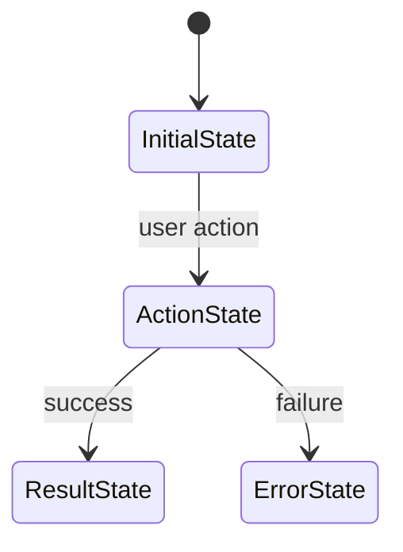

# Technical Specification: {{FEATURE_NAME}}

**PRD:** `prd.md`
**Status:** Draft
**Last updated:** {{DATE}}

---

## Table of Contents

1. [Executive Summary](#1-executive-summary)
2. [Problem Analysis](#2-problem-analysis)
3. [High-Level Design](#3-high-level-design)
4. [Integration Boundary Inventory](#4-integration-boundary-inventory)
5. [Testing Strategy](#5-testing-strategy)
6. [Implementation Plan](#6-implementation-plan)
7. [Trade-Off Analysis](#7-trade-off-analysis)
8. [Alternatives Considered](#8-alternatives-considered)
9. [Questions & Risks](#9-questions--risks)

---

## 1. Executive Summary

_One paragraph summarizing the change._

**Key changes:**

| Change | What | Where |
|--------|------|-------|
| _change 1_ | _description_ | _module/area_ |
| _change 2_ | _description_ | _module/area_ |

**Estimated effort:** _N phases, each independently shippable._

---

## 2. Problem Analysis

### 2.1 Current State

_Describe how the system works today. Show actual code flows with file references._

```
[Component A]
  → [Component B] (file: path/to/file.ext)
    → [Component C]
      → Result
```

### 2.2 Identified Gaps

| # | Gap | Current State | Impact |
|---|-----|--------------|--------|
| G1 | _What's missing_ | _How it works now_ | _Why this blocks us_ |
| G2 | _..._ | _..._ | _..._ |

---

## 3. High-Level Design

### 3.1 Component Overview

_Few large modules with clear APIs between them. Structure should scream the domain, not the framework._

```
┌─────────────────────────────────────┐
│           [Layer / Module]          │
│  [Component A]  [Component B]      │
└────────┬──────────────┬────────────┘
         │              │
         ▼              ▼
┌────────────────┐  ┌──────────────┐
│ [Component C]  │  │ [Component D]│
└────────────────┘  └──────────────┘
```

### 3.2 Data Flow

_Show the key data flows with numbered steps._

```
1. [Trigger / entry point]
2. [Processing step]
3. [Storage / output]
```

### 3.3 Interface & API Definitions

_Define contracts between modules so BE and FE can develop independently. These are the source of truth for TDD and parallel development._

#### External APIs

| Endpoint / Method | Request Schema | Response Schema | Owner |
|-------------------|---------------|-----------------|-------|
| _e.g. POST /api/v1/export_ | `ExportRequest` | `ExportResponse` | _BE_ |

#### Internal Module Contracts

| Interface | Module | Purpose | Key Methods/Props |
|-----------|--------|---------|-------------------|
| _e.g. ExportService_ | _export_ | _Orchestrates export flow_ | `execute(config): Result<ExportResult>` |

#### Data Models / State Shapes

```typescript
// Define key types here — these enable TDD and mock creation
type ExampleModel = {
  id: string;
  // ...
};
```

### 3.4 UI Flow Diagram

_Show the user journey through screens/states. Skip if no UI._



---

## 4. Integration Boundary Inventory

_Every new "wire" the design activates. The riskiest boundaries become tracer-bullet candidates that `omt-create-tasks` schedules first. Local-dev wiring (Docker freshness, profile config, secrets path) counts as a boundary. Cross-repo schema dependencies count too — flag them._

| # | Boundary | Type | Cross-repo? | Risk | Probe / Mitigation |
|---|----------|------|-------------|------|--------------------|
| I1 | _e.g. Service A ↔ Service B (auth + GraphQL)_ | External integration | No | High | _Tracer bullet in M1 — round-trip one request_ |
| I2 | _Local DB connection in dev profile_ | Infra | No | Med | _Hello-world fixture verified in M1_ |
| I3 | _Repo X depends on Repo Y schema_ | Cross-repo | YES | High | _Pin schema version; contract test_ |

**Type:** External integration / Cross-repo / Infra / Auth boundary / Local-dev wiring
**Risk:** uncertainty × cost-of-being-wrong (Low / Med / High)

If you don't have access to a cross-repo dependency, request it before writing this section — don't guess at the contract.

---

## 5. Testing Strategy

_How this feature gets verified. Highest test level with the best effort/impact ratio per concern. Don't push everything to e2e; don't unit-test what only matters at integration. Behavior, not implementation._

### 5.1 Test pyramid for this feature

| Level | What runs here | Why this level |
|-------|---------------|----------------|
| Unit | _e.g. pure validation logic, error mappers_ | _Fast, deterministic, large coverage_ |
| Integration | _e.g. service ↔ DB, service ↔ external mock_ | _Catches contract drift, exercises adapters_ |
| E2E | _e.g. critical user journey end-to-end_ | _Sparingly — only for irreplaceable scenarios_ |

### 5.2 Behavior-level test cases per interface

_For each interface defined in 3.3, list the behaviors a test must verify. The executing agent uses this list as TDD targets._

_**Every PRD acceptance criterion (AC1, AC2, …) must appear in the `PRD AC` column on at least one row that is verified through the real entry point** (resolver / CLI / UI handler) — not only an inner unit. A PRD AC with no entry-point-level row is a coverage gap to resolve now. This table seeds the downstream Definition of Done and the reviewer's criterion→test check._

| Interface | Behavior to verify | Test level | PRD AC |
|-----------|-------------------|------------|--------|
| _e.g. recordChangeImpact.forPromotion (entry point)_ | _Edit a referenced value → impacted tables returned_ | Integration (e2e) | AC1 |
| _e.g. ExportService.execute_ | _Empty input → returns ValidationError without side effects_ | Unit | AC2 |
| _e.g. ExportService.execute_ | _Downstream failure → returns InfraError, transaction rolled back_ | Integration | AC2 |

### 5.3 Test infrastructure needs

- **Fixtures / fakes / mocks:** _what's needed, where it lives_
- **Test environments:** _local? containerized? real cloud account?_
- **Credentials / accounts:** _what the test agent needs access to_
- **Coverage targets:** _if any (often "all behaviors above"; numeric coverage is rarely useful)_

---

## 6. Implementation Plan

_Break into phases. Each phase should be independently shippable._

### Phase 1: [Name]

**Goal:** _One sentence._

**Files to modify:**
- `path/to/file.ext` — _what changes_

**Files to create:**
- `path/to/new/file.ext` — _purpose_

**Key details:**
- _Specific implementation guidance for this phase_

---

### Phase 2: [Name]

**Goal:** _One sentence._

_Same structure as Phase 1._

---

## 7. Trade-Off Analysis

_What doors does this implementation close? What do we gain in exchange?_

| Decision | Doors Closed | Doors Opened | Rationale |
|----------|-------------|--------------|-----------|
| _e.g. Use REST over GraphQL_ | _Can't do partial field selection_ | _Simpler caching, wider tooling_ | _Feature doesn't need field selection_ |

---

## 8. Alternatives Considered

| Approach | Description | Pros | Cons | Verdict |
|----------|------------|------|------|---------|
| **Option A (selected)** | _description_ | _pros_ | _cons_ | **Selected** |
| Option B | _description_ | _pros_ | _cons_ | Rejected — _reason_ |

---

## 9. Questions & Risks

### Questions

| # | Question | Status | Resolution |
|---|----------|--------|------------|
| Q1 | _Technical question_ | `PENDING` / `RESOLVED` | _Answer when resolved_ |

### Risks

| # | Risk | Likelihood | Mitigation |
|---|------|-----------|------------|
| R1 | _What could go wrong_ | Low/Medium/High | _How to handle_ |

---

## Approval

- [ ] Codebase researched (codebase-locator / codebase-analyzer / codebase-pattern-finder used in parallel)
- [ ] Web research done where the problem is a common-domain pattern
- [ ] Multiple approaches considered — user agreed on the recommended shape via free-form dialog
- [ ] Interfaces and contracts defined (schema-first)
- [ ] Diagrams included (component overview + data flow minimum)
- [ ] Integration Boundary Inventory complete (cross-repo deps flagged; local-dev wiring listed when applicable)
- [ ] Testing Strategy includes behavior-level test cases per interface, and every PRD acceptance criterion maps to at least one entry-point-level test (§5.2 `PRD AC` column)
- [ ] Architectural defaults applied (or deviations documented in Trade-Off Analysis)
- [ ] Trade-offs documented (doors closed / opened)
- [ ] Questions resolved or tracked
- [ ] Architecture approved by user

---

**Next step:** Create task breakdown via `omt-create-tasks`
